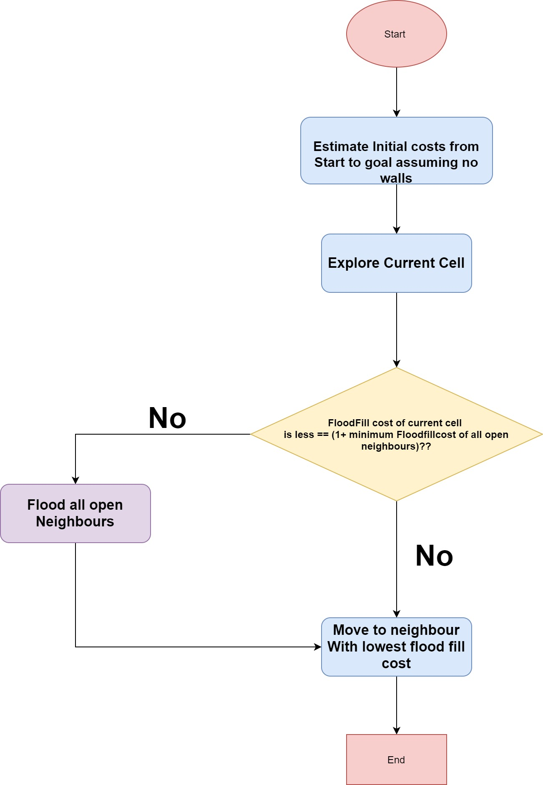
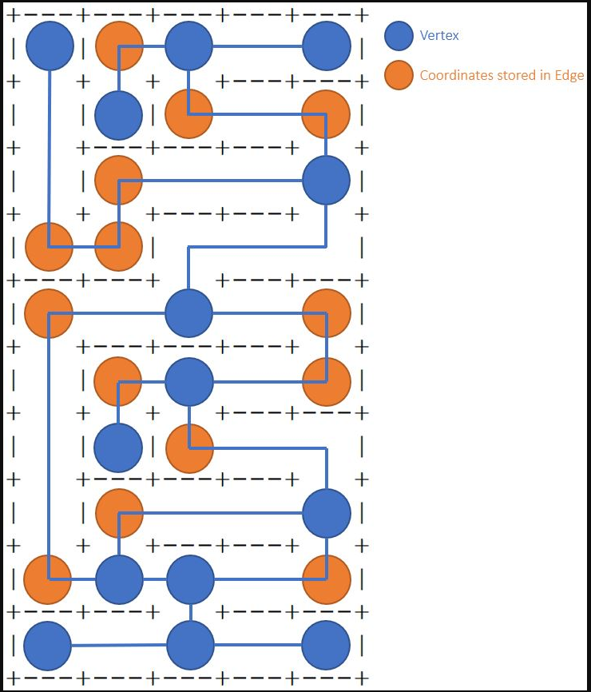

# Micromouse_E-Puck
## This project is an Extension of the  Micromouse Competition using Epuck in Webots
## Repository Owners:

[Priyanka Chand](https://github.com/PriyankaPrakashChand)  
[Jeremy Dsilva](https://github.com/JeremyDsilva)
***
## Project Description:

This project is inspired by the MicroMouse Competition in which we will solve a 16×16 maze.  
The robot is first allowed to explore the maze to locate the shortest path from the entrance to the center of the maze. After the robot is finished mapping the maze, it travels back to the entrance as quickly as it can.  
It then makes sequent run to using the shortest path to the center of the maze.  
In our project we will focus on different strategies to map the maze and finding the shortest path.

### Architectural Details

Modular: Yes  
Abstraction: Top-Down Approach  
Robot: E-Puck  
Sensors: Distance Sensor, Position Sensor  
Actuators: Left and Right Motor  
Planning Horizon: Requires Past (knowledge of Environment) and Present (current location on the map) and Future (Path planning)

## Goals:

### 1] Find the goal using the least amount of time

Required steps:  
1] Keep track of its current location  
2] Keep track of visited cells by mapping maze  
3] Make optimal decisions to reach goal by using knowledge of:  
a)current location  
b) maze that has been mapped, so far.  

### 2] Finding the best path from start point to goal, using the least amount of time

Required steps:  
1] Keep track of its current location  
2] Use knowledge of map to find path that takes the shortest path.  
Optimization between shortest distance, using straight paths, and minimizing number of directional changes (Dijkstra and A* could be used potentially).

## Other important notes:

1] Robot does not have inbuilt turning capability. Robot needs to use combination of adjusting speed of wheels and reading from position sensors to make the turns at the appropriate angle  
2] Robot does not always move in straight lines. Error correction needed based on distance sensor readings to correct for errors.  

## Environment

#### 1] Maze Design Constraint

a) Maze can be M * N cells.  
b) Initial designs will use M = N = 16.  
c)Cells are squares and have four corners  
d)Maze has a continuous outer wall on its perimeter.  
e)The maze is designed so that a wall is placed in contact with at least one corner of each cell. This does not include  
outer surrounding wall. f)Multiple paths to the destination square are allowed and expected.  
g) The maze is designed so that a wall hugging mouse will not be able to find it.  

#### 2] Starting Point

a)Robot can start at any location in maze.  
b)Robot will always face north.  
c)Starting position and maze dimensions will be known to the robot.  

#### 3] Destination Goal

a) The destination goal is a gateway to the four-cell square at the center of the maze.  
b) The destination square has only one gateway.  
c) Timer  
d)Timer starts when robot first leaves starting cell  
e) Timer ends when robot enters the destination  
f) Robot is free to explore maze after reaching destination  

### Additional Points:

Iteration 1: Maze environment could be automatically generated in Webots using an input of pre-defined mazes as text files.  
Iteration 2: Maze generation algorithms could replace the need for external input.

### Primitives Involved:

#### Sense

-Use distance sensors to sense the presence of a wall or obstruction  
-Use position sensor to measure distance covered  

#### Learn

- Save all processed sensor information about surrounding environment to generate a map and store it into memory  

#### Plan

- Use information about the environment from the memory and current robot location to create an initial plan about the optimal path.  

#### Act

Monitor current position - Follow the path based on the map  
- Move towards the goal  

### Modular components

#### Sense and learn

-Build maze by detecting walls on  
Right  
Ahead  
Left  
-Keep track of current location  
-Detect goal when robot reaches center of the maze  

#### Plan

Takes map, initial robot position, goal position and generates and stores a path (sequence of steps) based on the planning algorithm  

#### Act and sense

-Use current position to move based on planned path  
-Update current location.  
-Types of Modular Actions based on position sensor and speed values:  
From one tile to any adjacent tile  
Rotate in place
## Iteration1:

Figuring out orientation and setting up coordinates
***

## Iteration2: move to the center
***

Used Left Wall Follower code

## Iteration3: Explore Maze from Start to Goal Using Flood Fill Algorithm

### Modified FloodFill Algorithm

Using knowledge of current location and orientation to:  
-move to center  
-build the map  
-update the costs of each visited cell using  
At every point in time the robot knows its position.  
Everytime the robot moves to a cell, it checks if the floodfill cost allocated to the cell is valid:  
-if the cost is not valid the robot will update the cost of the cell at its current position and all other neighbouring cells.  
Everytime the robot visits a new cell (previously unexplored), it will sense for neighbouring walls and will update the maze map in memory.  
The flow chart below explains the sequential process:

  

### Video Demo for Iteration 3
Youtube Demo: https://www.youtube.com/embed/shkjjvti3Rk

----------

## Iteration4: Explore Maze from Goal back to Start Using Flood Fill Algorithm

The robot uses the same algorithm but uses and updates new weights (reverseFloodFillCost) to move back.  
On the way back the maze continues to get updates about news walls as the robot explores new cells.  
Moving back to start doesnt necessarily ensure that the complete maze has been explored.  
So therefore, even after mving back to the start, the maze is not completely explored.  

Yellow Path:All Cells that have been explored on the Route From From Start To Goal  
Blue Path: All Cells that have been explored on the Route From From Goal Back to Start  
We can notice that the maze is not completely explored

Youtube Demo: https://www.youtube.com/embed/kLZDHPHGYtk
***

## Iteration5: Implementation of BFS, Dijkstra, and Astar on Partially Explored Maze

Path finding algorithms implemented: BFS, Dijkstra, A_star Both Dijkstra and Astar use a cost function. To avoid the robot from choosing an unexplored path, the g(n) and h(n) will return a very high value if the current cell has not been explored  
BFS will fail and crash because it doesnt use cost function so it will entered an unexplored area and may drive into a wall because the initial assumpltion was that unexplored areas have no walls.  
Further, as seen in the video, the flood fill is yet not robust enought to solve more complex mazes as it is crashing.  
Ps. Note: Astar shows more turns (as much as double that of dijkstras), this is because of the minor error the turn counter is not being reset.  
Youtube Demo: https://www.youtube.com/embed/DM-XMnEnmLg
***

## Iteration6:  
A] Use Flood Fill To Generate Complete Map of the maze  
B] Pathfinding Using Dijkstra and AStar

In this phase the floodFill is more robust (with extra edge case detection) as it is able to solve maze 5 which was previously failing. Previously

The video Demonstrates both part A and B combined
Youtube Demo: https://www.youtube.com/embed/TMBu4YHYtAU
***
The console output for the last Maze in the video can be found in the same subfolder as this document  
Name of File:
***

## Iteration7: MicroMouse on Webots
Youtube Demo: https://www.youtube.com/embed/cRtKqav3Ajw
***

## Iteration8: Memory Optimzation for quicker path planning and

Now instead of moving single steps the robot can move n steps in any of the four directions  
The Maze is now being mapped more efficiently as it is only storing vertices and edges.  
As a result, less memory utilized. It is also quicker to move as the robot does need to deliberate for the next move at each step.  
Rather this happends at ever edge or vertex.  
Vertex and edge areclearly pointed out in the image below  

  
This can be seen in the video below:

Yellow Cells: All Cells that have been explored on the Route From Start To Goal  
green Cells: Nodes (vertex/edge) where decision is made  

## ************Video Demo for Iteration 8*************** [Must Watch]
Youtube Demo: https://www.youtube.com/embed/fRmBV_nr-6c
-----
The Console Output is stored in the file named:  **Iteration8ConsoleOutput.txt**

Between Iteration 7 and Iteration 8 we can see the optimization in terms of the green coloured cells.  
Iteration7: Decision of next move was taken at each cell (hence continuous path as shown in the video in section7)  
Iteration8: Decision of next move is being taken atedges and vertices only (hence discontinuous path as shown in the video in section8)  
***

## Iteration9: Automatic Maze Generation in Webots

Algorithm Used: Recursive Backtracking for Maze Generation

## ************Video Demo for Iteration 9************ [Must Watch]

Youtube Demo: https://www.youtube.com/watch?v=Qn5RMj1CaW0
***

## Limitations

One of the biggest limitations of our project is accuracy. While the simulater videos show that the deliberation and planning layer will work in almost all conditions, on webots we can notice issues due to odometry.  
The epuck tends to drift and has a high chance of getting stuck into a wall as depicted in iteration 7 and 8.  
Therefore Even though the maze generation can create huge mazes (greater than 16x16), it is highly likely that the epuck may notbe successfull in exploring the complete maze properly.  
From all the videos it i apparent that our code works absolutely fine on micromouse simulator (which also highlights the importance of making use of the simulater for development of the logical/deliberation layer).  
This issue mainly persists because Micromouse robots are much more precise than epuck robots.  
We mainly focuse on an 8 by 8 maze for the purpose of this project, therefore one possible future extension for this project could be to work on eliminating odometry issues so that the epuck micromouse can move around larger mazes. On Important parameter that we were not able to meet was minimizing the turns take.  
The time constraints and the complexity of the current code and the amount of time spent debugging and fine tuning the accuracy to this level consumed alot of our efforts and time and hence this would be another essential future extention of our project.

## References:

[https://en.wikipedia.org/wiki/Maze_generation_algorithm](https://en.wikipedia.org/wiki/Maze_generation_algorithm)  
[https://ieeexplore-ieee-org.aus.idm.oclc.org/stamp/stamp.jsp?tp=&arnumber=9096193](https://ieeexplore-ieee-org.aus.idm.oclc.org/stamp/stamp.jsp?tp=&arnumber=9096193)  
[https://ieeecharusat.wordpress.com/2010/09/23/the-flood-modified-flood-fill-algorithm-micromouse/](https://ieeecharusat.wordpress.com/2010/09/23/the-flood-modified-flood-fill-algorithm-micromouse/)  
[https://en.wikipedia.org/wiki/Flood_fill](https://en.wikipedia.org/wiki/Flood_fill)  
[http://web.cecs.pdx.edu/~edam/Reports/2001/DWillardson.pdf](http://web.cecs.pdx.edu/~edam/Reports/2001/DWillardson.pdf)

***
